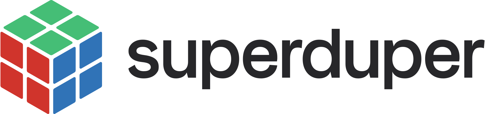
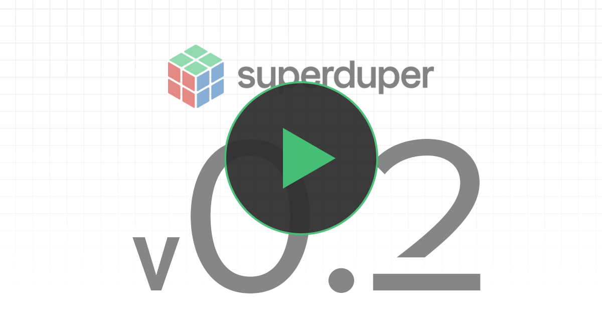
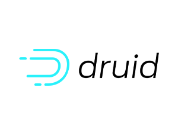
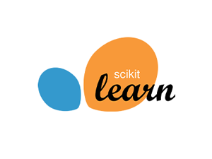
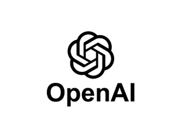

<p align="center">
  <a href="https://www.superduper.io">
    <picture>
      <source media="(prefers-color-scheme: dark)" srcset="docs/static/img/SuperDuperDB_logo_white.svg">
      <source media="(prefers-color-scheme: light)" srcset="docs/static/img/SuperDuperDB_logo_color.svg">
      
    </picture>
  </a>
</p>

<div align="center">

## Bring AI to your favorite database!

</div>

<div align="center">

## <a href="https://superduper.github.io/superduper/"><strong>Docs</strong></a> | <a href="https://blog.superduper.io"><strong>Blog</strong></a> | <a href="https://docs.superduper.io/docs/category/use-cases"><strong>Use-Cases</strong></a> | <a href="https://docs.superduper.io/docs/docs/get_started/installation"><strong> Installation</strong></a> | <a href="https://github.com/superduper-io/superduper-community-apps"><strong>Community Apps</strong></a> |  <a href="https://join.slack.com/t/superduper/shared_invite/zt-1zuojj0k0-RjAYBs1TDsvEa7yaFGa6QA"><strong> Slack </strong></a> | <a href="https://www.youtube.com/channel/UC-clq9x8EGtQc6MHW0GF73g"><strong> Youtube </strong></a>

</div>


<div align="center">
	<a href="https://pypi.org/project/superduperdb"></a>
  	<a href="https://pypi.org/project/superduperdb"></a>    
	<a href="https://github.com/superduper-io/superduper/actions/workflows/ci_code.yml"></a>
	<a href="https://github.com/superduper-io/superduper/blob/main/LICENSE"></a>	
	<a href="https://twitter.com/superduperdb" target="_blank"></a>
</div>


---

### :mega:  ***We are in the middle of rebranding from [https://github.com/SuperDuperDB/superduperdb](https://github.com/SuperDuperDB/superduperdb) to [https://github.com/superduper-io/superduper](https://github.com/superduper-io/superduper), so bear with us if anything is broken!***

---


## What is superduper.io? 🔮 

superduper.io is a Python framework for integrating AI models, APIs, and vector search engines **directly with your existing databases**, including hosting of your own models, streaming inference and scalable model training/fine-tuning.


## Key Features:
- **[Integration of AI with your existing data infrastructure](https://docs.superduper.io/docs/docs/walkthrough/apply_models):** Integrate any AI models and APIs with your databases in a single scalable deployment, without the need for additional pre-processing steps, ETL or boilerplate code.
- **[Inference via change-data-capture](https://docs.superduper.io/docs/docs/walkthrough/daemonizing_models_with_listeners):** Have your models compute outputs automatically and immediately as new data arrives, keeping your deployment always up-to-date.
- **[Scalable Model Training](https://docs.superduper.io/docs/docs/walkthrough/training_models):** Train AI models on large, diverse datasets simply by querying your training data. Ensured optimal performance via in-build computational optimizations.
- **[Model Chaining](https://docs.superduper.io/docs/docs/walkthrough/linking_interdependent_models/)**: Easily setup complex workflows by connecting models and APIs to work together in an interdependent and sequential manner.
- **[Simple Python Interface](https://docs.superduper.io/docs/docs/fundamentals/procedural_vs_declarative_api)**: Replace writing thousand of lines of glue code with simple Python commands, while being able to drill down to any layer of implementation detail, like the inner workings of your models or your training details.
- **[Python-First](https://docs.superduper.io/docs/docs/fundamentals/procedural_vs_declarative_api)**: Bring and leverage any function, program, script or algorithm from the Python ecosystem to enhance your workflows and applications.
- **[Difficult Data-Types](https://docs.superduper.io/docs/docs/walkthrough/encoding_special_data_types/)**: Work directly with images, video, audio in your database, and any type which can be encoded as `bytes` in Python.
- **[Feature Storing](https://docs.superduper.io/docs/docs/walkthrough/encoding_special_data_types):** Turn your database into a centralized repository for storing and managing inputs and outputs of AI models of arbitrary data-types, making them available in a structured format and known environment.
- **[Vector Search](https://docs.superduper.io/docs/docs/walkthrough/vector_search):** No need to duplicate and migrate your data to additional specialized vector databases - turn your existing battle-tested database into a fully-fledged multi-modal vector-search database, including easy generation of vector embeddings and vector indexes of your data with preferred models and APIs.

<div align="center">
<a href="https://www.youtube.com/watch?v=dDJ_ktMtbw0"></a>
</div>

## What's new in `v0.2`?

We've been working hard improving the quality of the project and bringing new features at the intersection of AI and databasing.

### New features

- Full support for `ray` as a "compute" backend (inference and training)
- The SuperDuper "protocol" for serializing compound AI-components
- Support for self-hosting LLMs with integrations of v-LLM, Llama.cpp and `transformers` fine-tuning,
  in particular leveraging `ray` features.
- Restful server implementation

### New integrations

- `ray`
- `jina`
- `transformers` (fine-tuning)
- `llama_cpp`
- `vllm`

### Developer contract

- Easier path to integrating AI models and components. Developers only need to implement these methods:

| Optional | Method | Description |
| --- | --- | --- |
| `False` | `Model.predict` | Predict on one datapoint |
| `False` | `Model.predict_batches` | Predict on batches of datapoints |
| `True` | `Model.fit` | Fit the model on datasets |

- Easier path to integrating new databases and vector-search functionalities. Developers only need to implement:

| Method | Description |
| --- | --- |
| `Query.documents` | Documents referred to by a query |
| `Query.type` | `"insert"`<br />`"delete"`<br />`"select"`<br />`"update"` |
| `Query._create_table_if_not_exists` | Create table in databackend if it doesn't exist |
| `Query.primary_id` | Get primary-id of base table in query |
| `Query.model_update` | Construct a model-update query |
| `Query.add_fold` | Add a fold to a `select` query |
| `Query.select_using_ids` | Select data using only ids |
| `Query.select_ids` | Select the ids of some data |
| `Query.select_ids_of_missing_outputs` | Select the ids of rows which haven't got outputs yet |

***Better quality***

- Fully re-vamped test-suite with separation into the following categories

| Type | Description | Command |
| --- | --- | --- | 
| Unit | Unittest - isolated code unit functionality | `make unit_testing` |
| AI integration | Test the installation together with external AI provider works | `make ext_testing` |
| Databackend integration | Test the installation with a fully functioning database backend | `make databackend_testing` |
| Smoke | Test the full integration with `ray`, vector-search service, data-backend, change-data capture | `make smoke_testing` |
| Rest | Test the Rest-ful server implementation integrates with the rest of the project | `make rest_testing` |

***Better documentation***

- [Flexible and modular use-cases](https://docs.superduper.io/docs/category/use-cases/)
- [Structure which reflects project structure and philosophy](https://docs.superduper.io/docs/intro)
- [End-2-end docusaurus documentation, including utilities to build API documentation as docusaurus pages]()

## Example use-cases and apps (notebooks)

The notebooks below are examples how to make use of different frameworks, model providers, vector databases, retrieval techniques and so on. 

To learn more about *how* to use superduper.io with your database, please check our [Docs](https://docs.superduper.io/) and official [Tutorials](https://docs.superduper.io/docs/docs/walkthrough/tutorial_walkthrough).

Also find use-cases and apps built by the community in the [superduper-community-apps repository](https://github.com/superduper-io/superduper-community-apps).

<table >

| Name                                                   | Link                                                                                                                                                                                                                                               |
|--------------------------------------------------------|----------------------------------------------------------------------------------------------------------------------------------------------------------------------------------------------------------------------------------------------------|
| Multimodal vector-search with a range of models and datatypes | <a href="https://colab.research.google.com/github/superduper-io/superduper/blob/main/docs/content/use_cases/multimodal_vector_search_image.ipynb" target="_parent"></a>       |
| RAG with self-hosted LLM            | <a href="https://colab.research.google.com/github/superduper.io/superduper/blob/main/docs/content/use_cases/retrieval_augmented_generation.ipynb" target="_parent"></a>                   |
| Fine-tune an LLM on your database | <a href="https://github.com/superduper-io/superduper/blob/main/docs/content/use_cases/fine_tune_llm_on_database.ipynb" target="_parent"></a>                   |
| Featurization and fransfer learning           | <a href="https://github.com/superduper-io/superduper/blob/main/docs/content/use_cases/transfer_learning.ipynb" target="_parent"></a>  |

</table >

For more information about superduper.io and why we believe it is much needed, [read this blog post](https://blog.superduper.io/superduper-the-open-source-framework-for-bringing-ai-to-your-datastore/). 


## Supported Datastores (*more coming soon*):

<table>
    <tr>
        <td align="center" width="140" height="112.43">
            
        </td>
        <td align="center" width="140" height="112.43">
            
        </td>
        <td align="center" width="140" height="112.43">
            
        </td>
        <td align="center" width="140" height="112.43">
            
        </td>
        <td align="center" width="140" height="112.43">
            
        </td>
    </tr>
    <tr>
        <td align="center" width="140" height="112.43">
            
        </td>
        <td align="center" width="140" height="112.43">
            
        </td>
        <td align="center" width="140" height="112.43">
            
        </td>
        <td align="center" width="140" height="112.43">
            
        </td>
        <td align="center" width="140" height="112.43">
            
        </td>
    </tr>
    <tr>
        <td align="center" width="140" height="112.43">
            
        </td>
        <td align="center" width="140" height="112.43">
            
        </td>
        <td align="center" width="140" height="112.43">
            
        </td>
        <td align="center" width="140" height="112.43">
            
        </td>
        <td align="center" width="140" height="112.43">
            
        </td>
    </tr>
    <tr>
        <td align="center" width="140" height="112.43">
            
        </td>
        <td align="center" width="140" height="112.43">
            
        </td>
        <td align="center" width="140" height="112.43">
            
        </td>
        <td align="center" width="140" height="112.43">
            
        </td>
    </tr>

</table>

**Transform your existing database into a Python-only AI development and deployment stack with one command:**

```
db = superduper('mongodb|postgres|mysql|sqlite|duckdb|snowflake://<your-db-uri>')
```

## Supported AI Frameworks and Models (*more coming soon*):

<table>
    <tr>
        <td align="center" width="140" height="112.43">
            
        </td>
        <td align="center" width="140" height="112.43">
            
        </td>
        <td align="center" width="140" height="112.43">
            
        </td>
    </tr>
</table>

**Integrate, train and manage any AI model (whether from open-source, commercial models or self-developed) directly with your datastore to automatically compute outputs with a single Python command:**


## Pre-Integrated AI APIs (*more coming soon*):

<table >
    <tr>
        <td align="center" width="140" height="112.43">
            
        </td>
        <td align="center" width="140" height="112.43">
            
        </td>
        <td align="center" width="140" height="112.43">
            
        </td>
        <td align="center" width="140" height="112.43">
            
        </td>
    </tr>
</table>

**Integrate externally hosted models accessible via API to work together with your other models with a simple Python command:**

## Infrastructure Diagram

<p align="center">
  
</p>


## Installation

#### # Option 1. superduper.io Library
Ideal for building new AI applications.
```shell
pip install superduper
```

#### # Option 2. superduper.io Container
Ideal for learning basic superduper.io functionalities and testing notebooks.
```shell
docker pull superduperio/superduper
docker run -p 8888:8888 superduperio/superduper
```

#### # Option 3. superduper.io Testenv
Ideal for learning advanced superduper.io functionalities and testing whole AI stacks.
```shell
make build_sandbox
make testenv_init
```

## Preview

[Browse the re-usable snippets](https://docs.superduper.io/docs/category/reusable-snippets) to understand how to accomplish difficult AI end-functionality
with few lines of code using superduper.io.

## Community & Getting Help 

#### If you have any problems, questions, comments, or ideas:
- Join <a href="https://join.slack.com/t/superduper/shared_invite/zt-1zuojj0k0-RjAYBs1TDsvEa7yaFGa6QA">our Slack</a> (we look forward to seeing you there).
- Search through <a href="https://github.com/superduper-io/superduper/discussions">our GitHub Discussions</a>, or <a href="https://github.com/superduper-io/superduper/discussions/new/choose">add a new question</a>.
- Comment <a href="https://github.com/superduper-io/superduper/issues/">an existing issue</a> or create <a href="https://github.com/superduper-io/superduper/issues/new/choose">a new one</a>.
- Help us to improve superduper.io by providing your valuable feedback <a href="https://docs.google.com/forms/d/e/1FAIpQLScKNyLCjSEWAwc-THjC7NJVDNRxQmVR5ey30VVayPhWOIhy1Q/viewform">here</a>!
- Email us at `gethelp@superduper.io`.
- Feel free to contact a maintainer or community volunteer directly! 


## Contributing  

#### There are many ways to contribute, and they are not limited to writing code. We welcome all contributions such as:


- <a href="https://github.com/superduper-io/superduper/issues/new/choose">Bug reports</a>
- <a href="https://github.com/superduper-io/superduper/issues/new/choose">Documentation improvements</a>
- <a href="https://github.com/superduper-io/superduper/issues/new/choose">Enhancement suggestions</a>
- <a href="https://github.com/superduper-io/superduper/issues/new/choose">Feature requests</a>
- <a href="https://github.com/superduper-io/superduper/issues/new/choose">Expanding the tutorials and use case examples</a>

Please see our [Contributing Guide](CONTRIBUTING.md) for details.

## Contributors
#### Thanks goes to these wonderful people:

<a href="https://github.com/superduper-io/superduper/graphs/contributors">
  
</a>


## License  

superduper.io is open-source and intended to be a community effort, and it wouldn't be possible without your support and enthusiasm.
It is distributed under the terms of the Apache 2.0 license. Any contribution made to this project will be subject to the same provisions.

## Join Us 

We are looking for nice people who are invested in the problem we are trying to solve to join us full-time. Find roles that we are trying to fill <a href="https://join.com/companies/superduper">here</a>!
