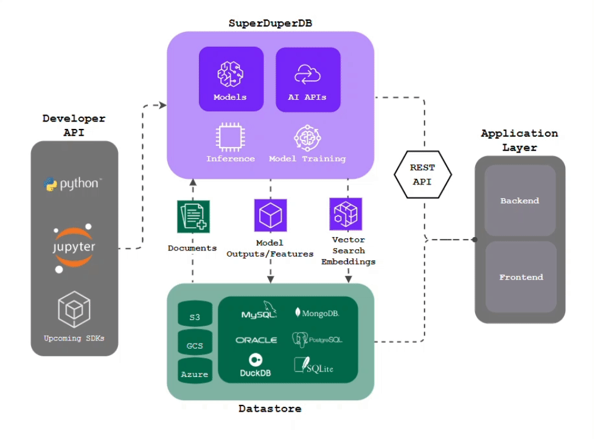

<p align="center">
  <a href="https://www.superduperdb.com">
    
  </a>
</p>
<div align="center">

# お気に入りのデータベースに AI を導入しよう！

</div>

<div align="center">

## <a href="https://superduperdb.github.io/superduperdb/"><strong>Docs</strong></a> | <a href="https://docs.superduperdb.com/blog"><strong>Blog</strong></a> | <a href="https://docs.superduperdb.com/docs/category/use-cases"><strong>Use-Cases</strong></a> | <a href="https://demo.superduperdb.com"><strong> Live Notebooks</strong></a> | <a href="https://github.com/SuperDuperDB/superduper-community-apps"><strong>Community Apps</strong></a> |  <a href="https://join.slack.com/t/superduperdb/shared_invite/zt-1zuojj0k0-RjAYBs1TDsvEa7yaFGa6QA"><strong> Slack </strong></a> | <a href="https://www.youtube.com/channel/UC-clq9x8EGtQc6MHW0GF73g"><strong> Youtube </strong></a>

</div>


<div align="center">
	<a href="https://pypi.org/project/superduperdb"></a>
	<a href="https://pepy.tech/project/superduperdb"></a>
  	<a href="https://pypi.org/project/superduperdb"></a>
	<a href="https://github.com/SuperDuperDB/superduperdb/actions/workflows/ci_code.yml"></a>
	<a href="https://codecov.io/gh/superduperdb/superduperdb/branch/main"></a>
	<a href="https://github.com/superduperdb/blob/main/LICENSE"></a>
	<a href="https://twitter.com/superduperdb" target="_blank"></a>

[**English**](README.md) |
[**中文**](README_zh.md) |
<b>日本語</b>


</div>


## SuperDuperDB とは？ 🔮

SuperDuperDB は、ストリーミング推論、スケーラブルなモデルトレーニング、ベクトル検索など、AI を既存のデータベースに直接統合するためのオープンソースのフレームワークです。

SuperDuperDB はデータベースではありません。お気に入りのデータベースを AI の開発・配備環境に変身させるもので、`db = superduper(db)` と考えてください。

SuperDuperDB は複雑な MLOps パイプラインや特殊なベクターデータベースを排除します - また、データのソースである既存のデータインフラストラクチャの直上にAIを統合することで、データの移行や複製を行う必要がなくなります。これにより、AI アプリケーションの構築と管理が大幅に簡素化されます:

- 生成 AI と LLM-Chat
- ベクトル検索
- 標準的な機械学習のユースケース（分類、セグメンテーション、推薦など）
- 超特殊モデルを含む高度にカスタム化された AI ユースケース

**はじめに:**
私たちがすでに実装したユースケースを[ドキュメント](https://docs.superduperdb.com/docs/category/use-cases)で、またコミュニティによって専用の [superduper-community-apps リポジトリ](https://github.com/SuperDuperDB/superduper-community-apps) で構築されたアプリをチェックし、[ブラウザで Jupyter](https://demo.superduperdb.com/) でそれらすべてを試してみてください！

`SuperDuperDB はオープンソースです: プロジェクトをサポートするために star してください！ ⭐`


SuperDuperDB についての詳細と、私たちが SuperDuperDB を必要とする理由については、[このブログ記事をお読みください](https://docs.superduperdb.com/blog/superduperdb-the-open-source-framework-for-bringing-ai-to-your-datastore/)。

<div align="center">

[](https://www.youtube.com/watch?v=FxJs7pbHj3Q)

</div>

### 主な特徴:
- **[既存のデータインフラと AI の統合](https://docs.superduperdb.com/docs/docs/walkthrough/apply_models):** 前処理、ETL、定型コードを追加することなく、スケーラブルな単一のデプロイメントで、あらゆる AI モデルと API をデータベースに統合します。
- **[ストリーミング推論](https://docs.superduperdb.com/docs/docs/walkthrough/daemonizing_models_with_listeners):** 新しいデータが到着すると、モデルが自動的に即座に出力を計算するため、デプロイを常に最新の状態に保つことができます。
- **[スケーラブルなモデルトレーニング](https://docs.superduperdb.com/docs/docs/walkthrough/training_models):** トレーニングデータをクエリするだけで、大規模で多様なデータセットでAIモデルをトレーニング。インビルドの計算最適化により、最適なパフォーマンスを保証します。
- **[モデルチェイニング](https://docs.superduperdb.com/docs/docs/walkthrough/linking_interdependent_models/)**: モデルと API を相互依存的かつ逐次的に連携させることで、複雑なワークフローを簡単に設定できます。
- **[シンプル且つ拡張可能なインターフェース](https://docs.superduperdb.com/docs/docs/fundamentals/procedural_vs_declarative_api)**: Python エコシステムからあらゆる関数、プログラム、スクリプト、アルゴリズムを追加、活用し、ワークフローやアプリケーションを強化します。シンプルな Python コマンドで SuperDuperDB を操作しながら、モデルの内部構造を含む実装のあらゆるレイヤーまでドリルダウンすることができます。
- **[扱いにくいデータ型](https://docs.superduperdb.com/docs/docs/walkthrough/encoding_special_data_types/)**: データベース内の画像、動画、音声、そして Python で `bytes` としてエンコードできるあらゆる型を直接扱うことができます。
- **[機能の保存](https://docs.superduperdb.com/docs/docs/walkthrough/encoding_special_data_types):** データベースを、任意のデータ型のAIモデルの入出力を保存・管理するための一元化されたリポジトリに変え、構造化されたフォーマットと既知の環境で利用できるようにします。
- **[ベクトル検索](https://docs.superduperdb.com/docs/docs/walkthrough/vector_search):** ベクターデータベースにデータを移行する必要がありません - 好みのモデルと API を使用して、データのベクトル埋め込みとベクトルインデックスを簡単に生成できます。

### なぜ SuperDuperDB を選ぶのか？
|                            | SuperDuperDBを利用する場合 | 利用しない場合 |
|----------------------------|-|-|
| データ管理とセキュリティ       | データはデータベースに保存され、AI の出力は下流のアプリケーションで利用可能な入力と一緒に保存される。データへのアクセスとセキュリティは、データベースアクセス管理によって外部から制御される。  |  データの重複や異なる環境への移行、特殊なベクターデータベースなど、データ管理のオーバーヘッドが発生する。   |
| インフラ                    | お客様の AI アプリケーションを構築、リリース、管理するための単一環境で、スケーラビリティと最適な計算効率を実現します。    |  複数のパイプラインを持つ複雑な断片化されたインフラは、高い導入コストとメンテナンスコストを伴い、セキュリティリスクを増大させる。 |
| コード                      | シンプルな Python コマンドを必要とする、シンプルで宣言的な API により、学習曲線は最小限です。 |  何百行ものコードと、さまざまな環境やツールでの設定。     |


## サポートされているデータストア (*近日さらに追加予定*):

<table>
    <tr>
        <td align="center" width="140" height="112.43">
            
        </td>
        <td align="center" width="140" height="112.43">
            
        </td>
        <td align="center" width="140" height="112.43">
            
        </td>
        <td align="center" width="140" height="112.43">
            
        </td>
        <td align="center" width="140" height="112.43">
            
        </td>
    </tr>
    <tr>
        <td align="center" width="140" height="112.43">
            
        </td>
        <td align="center" width="140" height="112.43">
            
        </td>
        <td align="center" width="140" height="112.43">
            
        </td>
        <td align="center" width="140" height="112.43">
            
        </td>
        <td align="center" width="140" height="112.43">
            
        </td>
    </tr>
    <tr>
        <td align="center" width="140" height="112.43">
            
        </td>
        <td align="center" width="140" height="112.43">
            
        </td>
        <td align="center" width="140" height="112.43">
            
        </td>
        <td align="center" width="140" height="112.43">
            
        </td>
        <td align="center" width="140" height="112.43">
            
        </td>
    </tr>
    <tr>
        <td align="center" width="140" height="112.43">
            
        </td>
        <td align="center" width="140" height="112.43">
            
        </td>
        <td align="center" width="140" height="112.43">
            
        </td>
        <td align="center" width="140" height="112.43">
            
        </td>
    </tr>

</table>

**コマンド 1 つで既存のデータベースを Python のみの AI 開発・導入スタックに変換:**

```
db = superduper('mongodb|postgres|sqlite|duckdb|snowflake://<your-db-uri>')
```

## サポートされている AI フレームワークとモデル（*近日さらに追加予定*）:

<table>
    <tr>
        <td align="center" width="140" height="112.43">
            
        </td>
        <td align="center" width="140" height="112.43">
            
        </td>
        <td align="center" width="140" height="112.43">
            
        </td>
    </tr>
</table>

**あらゆる AI モデル（オープンソース、商用モデル、自社開発モデルを問わず）をデータストアに直接統合、学習、管理し、Python コマンド 1 つで自動的に出力を計算します:**

- モデルのインストールとデプロイ:

```
m = db.add(
    <sklearn_model>|<torch_module>|<transformers_pipeline>|<arbitrary_callable>,
    preprocess=<your_preprocess_callable>,
    postprocess=<your_postprocess_callable>,
    encoder=<your_datatype>
)
```

- 予測:

```
m.predict(X='<input_column>', db=db, select=<mongodb_query>, listen=False|True, create_vector_index=False|True)
```

- モデルのトレーニング:

```
m.fit(X='<input_column_or_key>', y='<target_column_or_key>', db=db, select=<mongodb_query>|<ibis_query>)
```


## 事前統合された AI API (*詳細は近日公開*):

<table >
    <tr>
        <td align="center" width="140" height="112.43">
            
        </td>
        <td align="center" width="140" height="112.43">
            
        </td>
        <td align="center" width="140" height="112.43">
            
        </td>
    </tr>
</table>

**API 経由でアクセス可能な外部ホストモデルを統合し、シンプルな Python コマンドで他のモデルと連動させる:**

```
m = db.add(
    OpenAI<Task>|Cohere<Task>|Anthropic<Task>(*args, **kwargs),   # <Task> - Embedding,ChatCompletion,...
)
```


## インフラ図

<p align="center">
  
</p>


## 機能例

すぐに使える notebook [ブラウザでライブ](https://demo.superduperdb.com)をお試しください。

また、[superduper-community-apps リポジトリ](https://github.com/SuperDuperDB/superduper-community-apps)で、コミュニティによって構築されたユースケースやアプリも見つけることができます。


<table>
  <tr>
    <td width="30%">
      <a href="https://demo.superduperdb.com/user-redirect/lab/tree/multimodal_image_search_clip.ipynb">
        
      </a>
    </td>
    <td width="30%">
      <a href="https://demo.superduperdb.com/user-redirect/lab/tree/video_search.ipynb">
        
      </a>
    </td>
    <td width="30%">
      <a href="https://demo.superduperdb.com/user-redirect/lab/tree/question_the_docs.ipynb">
        
      </a>
    </td>
  </tr>
  <tr>
    <th>
      <a href="https://demo.superduperdb.com/user-redirect/lab/tree/multimodal_image_search_clip.ipynb">Text-To-Image 検索</a>
    </th>
    <th>
      <a href="https://demo.superduperdb.com/user-redirect/lab/tree/video_search.ipynb">Text-To-Video 検索</a>
    </th>
    <th>
      <a href="https://demo.superduperdb.com/user-redirect/lab/tree/question_the_docs.ipynb">ドキュメントに質問する</a>
    </th>
  </tr>
  <tr>
    <td width="30%">
      <a href="https://demo.superduperdb.com/user-redirect/lab/tree/vector_search.ipynb">
        
      </a>
    </td>
    <td width="30%">
      <a href="https://demo.superduperdb.com/user-redirect/lab/tree/mnist_torch.ipynb">
        
      </a>
    </td>
    <td width="30%">
      <a href="https://demo.superduperdb.com/user-redirect/lab/tree/transfer_learning.ipynb">
        
      </a>
    </td>
  </tr>
  <tr>
    <th>
      <a href="https://demo.superduperdb.com/user-redirect/lab/tree/vector_search.ipynb">セマンティック検索エンジン</a>
    </th>
    <th>
      <a href="https://demo.superduperdb.com/user-redirect/lab/tree/mnist_torch.ipynb">古典的な機械学習</a>
    </th>
    <th>
      <a href="https://demo.superduperdb.com/user-redirect/lab/tree/transfer_learning.ipynb">フレームワーク横断的学習</a>
    </th>
  </tr>
</table>


## インストール

#### 1. `pip` 経由で SuperDuperDB をインストールする *(~1 分)*:

**必要条件**:

- Python 3.10 or 3.11
- 動作する `pip` 

```
pip install superduperdb
```

#### 2. Docker 経由で SuperDuperDB を試す *(~2 分)*:

**必要条件**:

- 動作するdocker `docker` [インストール](https://docs.docker.com/engine/install/)

```
docker run -p 8888:8888 superduperdb/demo:latest
```

## プレビュー

以下は `superduperdb` の動作や使い方の簡単さを感じることができるスニペットです。詳しくは<a href="https://docs.superduperdb.com">ドキュメント</a>をご覧ください。


#### - ML/AI モデルをデータベースにデプロイする:
単一の環境で、データベースを使って自動的に出力（推論）を計算します。

```python
import pymongo
from sklearn.svm import SVC

from superduperdb import superduper

# Make your db superduper!
db = superduper(pymongo.MongoClient().my_db)

# Models client can be converted to SuperDuperDB objects with a simple wrapper.
model = superduper(SVC())

# Add the model into the database
db.add(model)

# Predict on the selected data.
model.predict(X='input_col', db=db, select=Collection(name='test_documents').find({'_fold': 'valid'}))
```


#### - データベースから直接モデルをトレーニング。
追加のデータ取り込みや前処理なしで、データベースをクエリするだけです:

```python
import pymongo
from sklearn.svm import SVC

from superduperdb import superduper

# Make your db superduper!
db = superduper(pymongo.MongoClient().my_db)

# Models client can be converted to SuperDuperDB objects with a simple wrapper.
model = superduper(SVC())

# Fit model on the training data.
model.fit(X='input_col', y='target_col', db=db, select=Collection(name='test_documents').find({}))
```

#### - ベクター-データを検索:
ベクトル検索データベースとして、既存のお気に入りのデータベースをご利用ください。

```python
# First a "Listener" makes sure vectors stay up-to-date
indexing_listener = Listener(model=OpenAIEmbedding(), key='text', select=collection.find())

# This "Listener" is linked with a "VectorIndex"
db.add(VectorIndex('my-index', indexing_listener=indexing_listener))

# The "VectorIndex" may be used to search data. Items to be searched against are passed
# to the registered model and vectorized. No additional app layer is required.
db.execute(collection.like({'text': 'clothing item'}, 'my-index').find({'brand': 'Nike'}))
```

#### - AI API を統合し、他のモデルと連携させる。
ベクトル検索用の埋め込みモデルとして、OpenAI、PyTorch、Hugging Face モデルを使用する。

```python
# Create a ``VectorIndex`` instance with indexing listener as OpenAIEmbedding and add it to the database.
db.add(
    VectorIndex(
        identifier='my-index',
        indexing_listener=Listener(
            model=OpenAIEmbedding(identifier='text-embedding-ada-002'),
            key='abstract',
            select=Collection(name='wikipedia').find(),
        ),
    )
)
# The above also executes the embedding model (openai) with the select query on the key.

# Now we can use the vector-index to search via meaning through the wikipedia abstracts
cur = db.execute(
    Collection(name='wikipedia')
        .like({'abstract': 'philosophers'}, n=10, vector_index='my-index')
)
```


#### - SuperDuperDB に Llama 2 モデルを追加する！:
```python
model_id = "meta-llama/Llama-2-7b-chat-hf"
tokenizer = AutoTokenizer.from_pretrained(model_id)
pipeline = transformers.pipeline(
    "text-generation",
    model=model_id,
    torch_dtype=torch.float16,
    device_map="auto",
)

model = Pipeline(
    identifier='my-sentiment-analysis',
    task='text-generation',
    preprocess=tokenizer,
    object=pipeline,
    torch_dtype=torch.float16,
    device_map="auto",
)

# You can easily predict on your collection documents.
model.predict(
    X=Collection(name='test_documents').find(),
    db=db,
    do_sample=True,
    top_k=10,
    num_return_sequences=1,
    eos_token_id=tokenizer.eos_token_id,
    max_length=200
)
```

#### - モデルの出力を下流モデルの入力として使用する:

```python
model.predict(
    X='input_col',
    db=db,
    select=coll.find().featurize({'X': '<upstream-model-id>'}),  # already registered upstream model-id
    listen=True,
)
```


## コミュニティとヘルプ

#### 何か問題、質問、コメント、アイデアがあれば、ご連絡ください:
- <a href="https://join.slack.com/t/superduperdb/shared_invite/zt-1zuojj0k0-RjAYBs1TDsvEa7yaFGa6QA">私たちの Slack</a> に参加してください（そこでお会いできるのを楽しみにしています）。
- <a href="https://github.com/SuperDuperDB/superduperdb/discussions">GitHub のディスカッション</a>を検索するか、<a href="https://github.com/SuperDuperDB/superduperdb/discussions/new/choose">新しい質問を追加</a>してください。
- <a href="https://github.com/SuperDuperDB/superduperdb/issues/">既存の issue</a> にコメントするか、<a href="https://github.com/SuperDuperDB/superduperdb/issues/new/choose">新しい issue</a> を作成してください。
- 貴重なフィードバックを<a href="https://docs.google.com/forms/d/e/1FAIpQLScKNyLCjSEWAwc-THjC7NJVDNRxQmVR5ey30VVayPhWOIhy1Q/viewform">こちら</a>に提供することで、SuperDuperDB の改善にご協力ください！
- `gethelp@superduperdb.com` まで電子メールをお送りください。
- メンテナやコミュニティボランティアに直接連絡してください！


## コントリビュート

#### 貢献の方法はたくさんあり、コードを書くことに限りません。私たちは以下のようなあらゆる貢献を歓迎します:


- <a href="https://github.com/SuperDuperDB/superduperdb/issues/new/choose">バグレポート</a>
- <a href="https://github.com/SuperDuperDB/superduperdb/issues/new/choose">ドキュメント改善</a>
- <a href="https://github.com/SuperDuperDB/superduperdb/issues/new/choose">強化の提案</a>
- <a href="https://github.com/SuperDuperDB/superduperdb/issues/new/choose">機能リクエスト</a>
- <a href="https://github.com/SuperDuperDB/superduperdb/issues/new/choose">チュートリアルとユースケース例の拡大</a>

詳しくは[コントリビューティングガイド](CONTRIBUTING.md)をご覧ください。

## コントリビューター
#### これらの素晴らしい人々に感謝します:

<a href="https://github.com/SuperDuperDB/superduperdb/graphs/contributors">
  
</a>


## ライセンス

SuperDuperDB はオープンソースであり、コミュニティの取り組みであることを意図しており、皆様のサポートと熱意なしでは不可能です。
Apache 2.0 ライセンスの下で配布されており、このプロジェクトへのいかなるコントリビュートも、同じ規定に従います。

## 参加する

私たちは、私たちが解決しようとしている問題に投資し、フルタイムで参加してくれる素敵な人材を探しています。<a href="https://join.com/companies/superduperdb">こちら</a>で募集している職務を検索してください！
