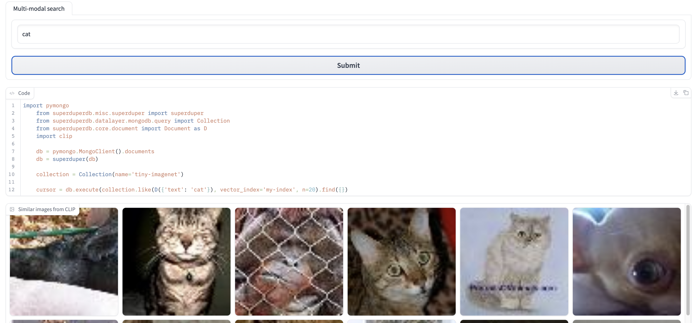

Hi,

sharing with you a draft of the blog post. It is not finished, but sharing it now as I won't have time to work on it any more on it this week.

I need to edit it for style again before it is publishable. 
-----

Target audience:

Primary: e-commerce web developers for small shops, who are somewhat familiar with python.

Secondary:
- python developers, not familiar with data science
- data scientists, who are not familiar with image search

----

# Seamless Semantic Image Search in MongoDB for E-Commerce

Add semantic image search to your product catalog, while staying within the comfort of the MongoDB ecosystem. Escape the high maintenance costs and poor user experience the keyword search.


## Introduction

Clients shopping on modern e-commerce websites often faces this problem. A simple search for "fork" may yield no results if the item is tagged as "cutlery" in the product catalog. Search relies too heavily on manual tagging. (TODO: Incorporate image examples as in this blog: https://wasimlorgat.com/posts/image-vector-search.html)

The solution to this user problem is to stop matching search keywords to the manual labels attached to products, and instead focus on understanding the meaning of the image and text. This is called "semantic search". We represent the meaning of a text or an image as a list of numbers ("a vector"). If two vectors are similar, then the meaning is the same. When a user searching for "a fork" we would return all the products that have an image vector similar to the vector for the word "fork".

The solution lies not in constantly manually attaching labels to match all the possible search keywords, but in decoding the meaning of images and text— an approach known as "semantic search." Here, the essence of text or an image is represented as a numeric array ("a vector"). Similar vectors imply identical meanings. Thus, a search for "a fork" would return all products with image vectors akin to the vector for the word "fork".

## What is CLIP?

So, how does one establish a meaningful correlation between vectors, words, and pixels?

Contrastive Language-Image Pretraining (CLIP) is a technique designed specifically for this purpose.

OpenAI has compiled millions of images from the web, along with their alt-text, to train a neural network that can align the image vector with its corresponding image caption vector, while distancing it from other captions and images.


(image from <https://www.pinecone.io/learn/series/image-search/clip/>)

## Technical challenges

Great, so now we can just take the model open-sourced by OpenAI in a [Python package](https://github.com/openai/CLIP) and run it on our product catalog, right?

Unfortunately there are still technical challenges to navigate:

- Collect all the images in one place.
- Run the model to get vectors for all the images already in the catalog
- Automatically generating vectors for new images as soon as they're added to the catalog.
- Identifying products with vectors similar to a text search query.
- Serving these results to the website front end code.

The usual way to do this is to setup a AWS Cloudformation templates to pre-process the images, run CLIP on them. All of this needs to be orchestrated via AirFlow DAG and added to the pipeline for adding new data.

To find similar vectors you will need to setup a new service - a vector database. There are plenty of them to choose from. Just choosing one might take a lot of time in the current landscape.

The backend search API endpoint needs to have a new workflow for serving a request. A text comes in, it is converted to a vector with CLIP, then a query is sent to the vector database to find ids of products similar vectors, and then these ids need to be retrieved from the product catalog and served back.

## SuperDuperDB Simplifies The Process

With SuperDuperDB, you can overcome these technical challenges in under 100 lines of code, as demonstrated [here](../../notebooks/blog_version_multimodal_image_search_clip.ipynb).

To achieve this we:

- store images as binary data in MongoDB;
- get image vectors from CLIP, parallelized via Dask
- store vectors in a vector database, LanceDB
- create a watcher thread that watches the database for new images and automatically generate vectors for them 

(**TODO:** this diagram is just a placeholder, make a smaller and more concise architecture diagram: Mongo, Lance, inference thread.)


### Store images in MongoDB

We start by taking the images from a dataset on disk and storing them in MongoDB.

By the way, getting to a stage of "dataset on disk" or "data in S3 bucket" might not be so easy, as they can be in many different places and micro-services. SuperDuperDB has easy ways to retrieve and process a remote resource URI. (**TODO**: link to docs or code )

In the below code snippet, we take an image from the dataset and encode it into a binary object for convenient storage in MongoDB.

(**TODO**: maybe make naming convention more aligned in the repo - camelcase or underscores, Document or pil_image )

```python
from superduperdb.core.document import Document as SuperDuperDocument

from superduperdb.encoders.pillow.image import pil_image as image_encoder

sdp_documents = [SuperDuperDocument({'image': image_encoder(r['image'])}) for r in dataset]

db.execute(collection.insert_many(sdp_documents, encoders=(image_encoder,)))
```

For a user-friendly data inspection, you can use [MongoDB Compass](https://www.mongodb.com/try/download/compass), a desktop UI. This is just one of the many perks of working within the MongoDB ecosystem.


SuperDuperDB has built-in encoders that streamline storage of complex data types—audio files, PyTorch tensors, vector embeddings.

# Vectorization of Images and Text

We then load a specific version of CLIP that runs on a CPU via PyTorch, and employ a SuperDuperDB PyTorch tensor encoder to store the model output in the DB.

```python
import torch
import clip

from superduperdb.encoders.torch.tensor import tensor as tensor_encoder
from superduperdb.models.torch.wrapper import TorchModel

my_tensor_encoder = tensor_encoder(torch.float, shape=(512,))

model, preprocess = clip.load("ViT-B/32", device='cpu')

text_model = TorchModel(
 identifier='clip_text',
 object=model,
 preprocess=lambda x: clip.tokenize(x)[0],
 forward_method='encode_text',
 encoder=my_tensor_encoder
)

visual_model = TorchModel(
 identifier='clip_image',
 preprocess=preprocess,
 object=model.visual,
 encoder=my_tensor_encoder,
)
```

Our next task involves adding vectors for each image already present in the collection. Moreover, we need to ensure that vectors for new images are automatically appended through an active indexing watcher. We also introduce a 'text' search feature via an inactive `compatible_watcher``.

```python
from superduperdb.core.vector_index import VectorIndex
from superduperdb.core.watcher import Watcher

db.add(
    VectorIndex(
        'my-index',
        indexing_watcher=Watcher(
            model=visual_model,
            key='image',
            select=collection.find(),
        ),
        compatible_watcher=Watcher(
            model=text_model,
            key='text',
            active=False,
        )
    )
)```

The following depicts how the model output is stored in MongoDB. Any model run will be stored in the _outputs field of the document used as input. Future versions will track and version each model run, so stay tuned.

```json
{
  "_id": {
    "$oid": "64c23c9ad761f1b1ca002444"
  },
  "image": {
    "_content": {
      "bytes": {
        "$binary": {
          "base64": "iVBORw0KGgo...",
          "subType": "00"
        }
      },
      "encoder": "pil_image"
    }
  },
  "_fold": "train",
  "_outputs": {
    "image": {
      "clip_image": {
        "_content": {
          "bytes": {
            "$binary": {
              "base64": "vyc7vEK/nL4oM...",
              "subType": "00"
            }
          },
          "encoder": "torch.float32[512]"
        }
      }
    }
  }
}
```


## Serving Search Results to the Web Front End

With SuperDuperDB, you can now generate a relevant list of images semantically linked to the user's search text, no need for manual tags. But how do we relay these results back to the application?

Let's start with the backend code. This Python code snippet from the interactive demo in this [notebook](../../notebooks/multimodal_image_search_clip.ipynb). 
(**TODO:** fix the formatting of the first line of code in the code snippet example)



This code generates a cursor, mirroring the usual MongoDB PyMongo cursor. To expose it as a REST API, you can employ FastAPI and serve it via a React front end, as demonstrated in this [demo](https://github.com/weaviate/weaviate-examples/tree/main/clip-multi-modal-text-image-search)

 (**TODO:** build analogue to this Weaviate FastApi React demo but with superduperDB,  show model confidence, add new image upload capability.)


If your system already uses the  [FARM Web-stack](https://www.mongodb.com/developer/languages/python/farm-stack-fastapi-react-mongodb/) (FastAPI, React, and MongoDB), then implementation will be smooth. We're developing a REST API that allows SuperDuperDB's vector index to collaborate with other web backends, such as Node.js or no-code Web frameworks like Bubble.

(**TODO:** question to you: is it actually the roadmap? :) ).

## Upcoming Blog Post: Model Training and Comparisons

In my upcoming blog post, I'll explore how to enhance search functionality for your specific e-commerce store.

For instance, suppose you run a specialized store that sells candles. While the standard CLIP model can distinguish between a candle and a candlestick, it can't differentiate between "tea light" and "pillar" candles.

With SuperDuperDB, you can easily train CLIP on your data with just a few lines of code. Depending on your image count, this training might take a couple of days on a GPU. To justify this time and cost, you'll want to ensure that your training code is efficient and bug-free. Here using an open-source solution like SuperDuperDB, gives more confidence. The open code has many eyes on it but people using it, and is built on the expertise of the maintainers who used this approach in commercial projects over the years.

SuperDuperDB also simplifies model comparisons on identical data.

To illustrate the ease of qualitative comparison between two models using SuperDuperDB, we've added two vector indices to the same MongoDB, searched them concurrently, and compared the results in a Gradio UI [here](../../notebooks/compare_multimodal_image_search_clip_openclip.ipynb) . The two models have the same CLIP architecture, but one was trained by OpenAI on their closed-source dataset and the other on the open-source [LAION 2B](https://huggingface.co/laion/CLIP-ViT-B-32-laion2B-s34B-b79K).


## Conclusion

SuperDuperDB provides an efficient and streamlined way to improve the search experience on your e-commerce platform. It enables you to transition from manual tagging to a more precise and intuitive semantic search, leveraging the power of CLIP models and MongoDB. This brings about new opportunities, such as presenting your users with more relevant search results, while reducing the burden of maintaining manual tags in your product catalog.

But the versatility of SuperDuperDB extends beyond merely enhancing image search. It offers seamless integration with MongoDB-based web stacks, provides utilities for comparing and testing models, and even supports model training for a more personalized, tailored search experience.

The future of e-commerce search isn't limited to keyword matching. It's about comprehending the user's intent and delivering the most pertinent results. And with SuperDuperDB, that future is within your grasp.

Semantic search is just the tip of the iceberg when it comes to SuperDuperDB's utility in e-commerce. It can work with sklearn models to classify new products, determining which section of the catalog they should be assigned to based on their CLIP image vectors, or even use OpenAI embeddings of their descriptions.

Stay tuned for our next blog post where we will delve deeper into training and comparing models to further customize and enhance your e-commerce platform's search experience.
