# Seamless Semantic Image Search in MongoDB for E-Commerce

## Introduction


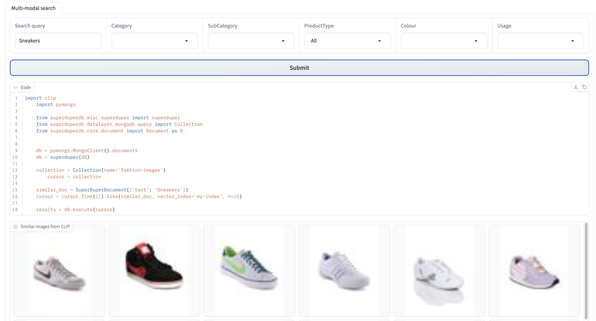

The latest advancement in AI - "semantic search" is now easy to add to your e-commerce site, thanks to SuperDuperDB integrating open-source libraries with MongoDB. See this [notebook](blog_version_multimodal_image_search_clip.ipynb). 

Semantic search eliminates the high maintenance costs and poor user experience of keyword search, where the use has to guess the exact terms the catalogue was labelled with. For example, searching for "sneakers" returns nothing because the items were labelled as "running shoes".

You can add semantic search capabilities to your store with less than 100 lines of Python by utilising SuperDuperDB and an open-source model CLIP from OpenAI.

This algorithm is just the tip of the iceberg when it comes to SuperDuperDB's utility in e-commerce. Our new package greatly simplifies personal shopper recommendations or set dynamic price setting. There are easy database integrations to use and fine-tune models based on HuggingFace Transformers, PyTorch, sklearn and OpenAI APIs.

## What Is Semantic Search?

A user comes to an online shop to buy sneakers - should they look in "Casual shoes" or "Sports shoes" categories?

Let's look at a realistic [example](https://www.kaggle.com/datasets/vikashrajluhaniwal/fashion-images) of an e-commerce product catalog for a fashion e-commerce. It contains 3000 images of of clothing and footwear, split by categories.
Here, the sneakers shoes are in both categories. It is unfortunate that the user has to do two searches to see the full selection of what they are looking for.

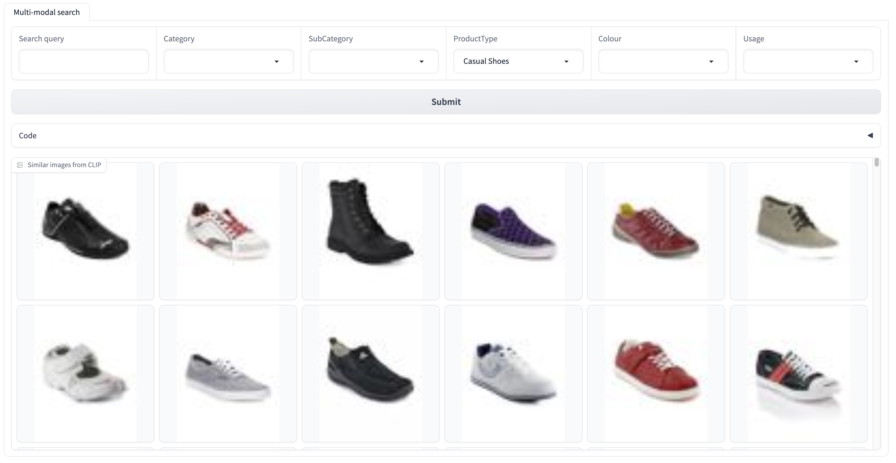
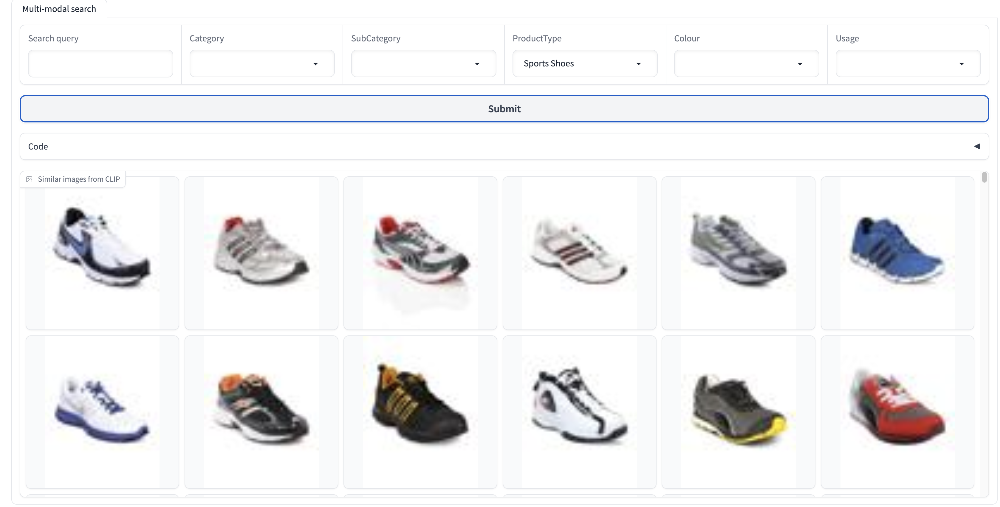

It happens very often that the user is searching for a keywords that is a synonym, but not quite the same as the label the catalogue creator attached to the product. 

What if instead of focusing on the exact word, we could understand the meaning of what the user is searching for? Another word for 'meaning' is 'semantics', that is why this approach is called "semantic search".

Here are all the sneakers in one view, found by SuperDuperDB and CLIP in response to a simple text query "sneakers"


It seems that the search engine has understood the concept "sneakers" even though there is no such tag in the product catalogue. How does it work under the hood?

First, every concept is represented by an array of numbers, otherwise called "a vector" or "an embedding". In this case it is a 512-dimensional vector representing the concept of "sneakers". We assign vectors to words and images.


**Sneakers** &#8594;

|   |   |   |   |
|---|---|---|---|
| 0.1 | 5.6 | ... | 7.7 | 
| #1   | #2   | ... | #512 | 


 &#8594;

|   |   |   |   |
|---|---|---|---|
| 0.2 | 5.3 | ... | 7.8 | 
| #1   | #2   | ... | #512 | 


What does this space of "meanings" look like? It is hard to imagine a 512-dimensional space, so let's start with just 2 dimensions that are familiar to us. We use 2-dimensional vectors all the time when we talk about the surface of planet Earth. Here are some cities together with their 2-dimensional vectors. The denoting their position in the space, otherwise known as (latitude, longitude). 

(Image is from [this](https://medium.com/deepset-ai/the-beginners-guide-to-text-embeddings-a3330bf9f8cd) great explanation of text embeddings
TODO: ask for permission to use.)


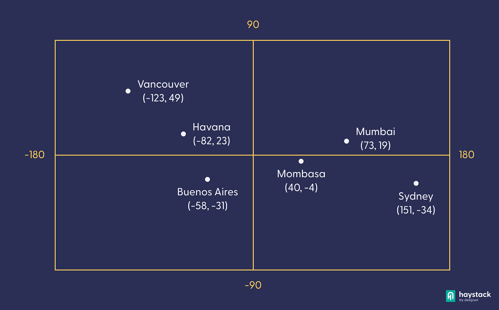

If we know vectors of two cities, then we can compute the distance we need to travel from one to another, "as the crow flies". The cities that are close together are usually in the same country, speak the same language and are quite similar in other ways.  So we can guess how similar the cities are just from their latitude and longitude.

That is exactly how semantic search finds concepts that have close meaning - they look for vectors that are close to each other. And in 512 dimensional space, we don't use latitude and longitude, in fact it is very rare that, say, dimension #12 has any meaning.

However there is a technique called t-SNE that can create an easy-to-understand 2-dimensional view from a more complicated multi-dimensional space.

This is our product catalog. "Sneakers" are close to a "T-Shirt". "Suit" is close to "tuxedo" as they are quite similar. And far away from "T-shirt" as they are worn in different circumstances.


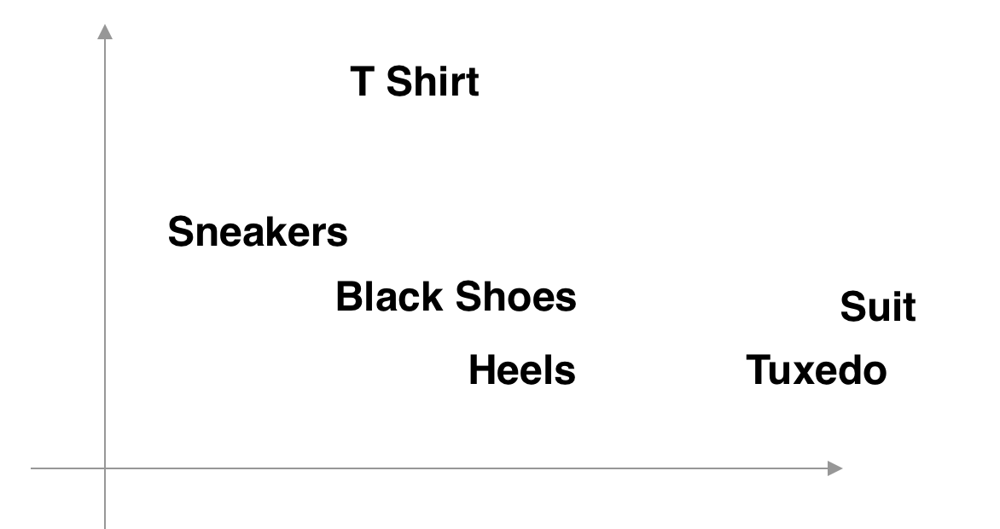


You can see groups of similar concepts together. One concept can be in two clusters - for example, "Sneakers" are both in the shoes and casual wear clusters. 
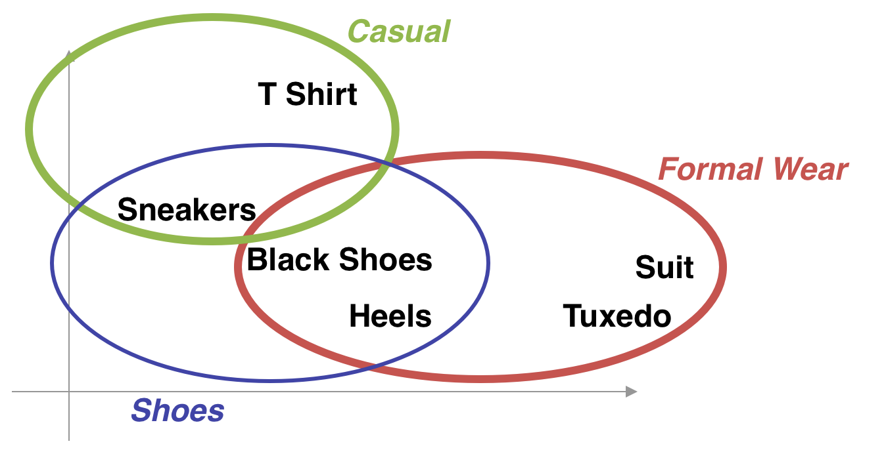

We can assign the meaning vectors not just to words, but also to images.
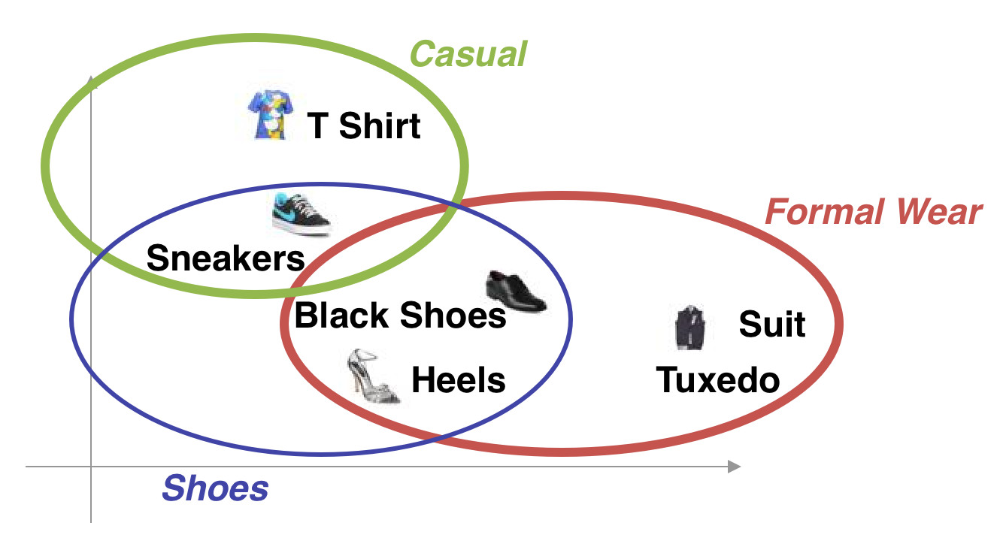

## What is CLIP?

In this tutorial we use a create semantic search model called CLIP.
It was developed and open-source as a [Python package](https://github.com/openai/CLIP) by OpenAI. It is completely free - there is no paid closed-source API that OpenAI are so famous for with ChatGPT.

How come CLIP is so good at creating meaning vectors? It is a deep learning model that learned from millions of image descriptions gathered from the web. OpenAI has collected pairs image plus its alt-text. The model was trained to make sure that the
two vectors the image and its alt-text stay close together, and at the same time that other images and other alt-texts are far away.

You can easily fine-tune CLIP on your own product catalogue with SuperDuperDB. More about that in up-coming blog posts.


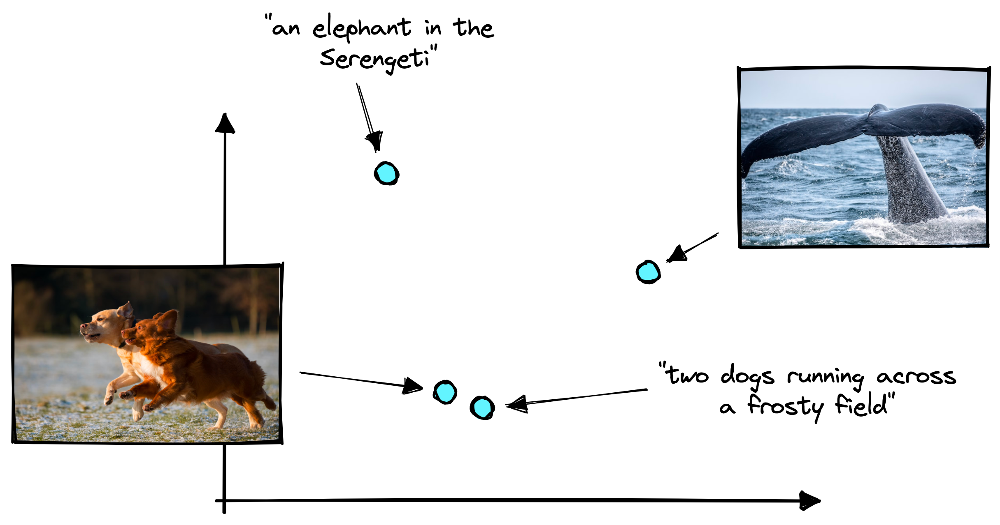

(image from <https://www.pinecone.io/learn/series/image-search/clip/>)

## Technical challenges

Great, now that the heavy lifting of pushing the deep learning frontier forward is done by OpenAI, we can just take it and run it in our web shop, right?

Unfortunately there are still technical challenges to navigate:

- Collect all the images in one place.
- Run the model to get vectors for all the images already in the catalog
- Automatically generating vectors for new images as soon as they're added to the catalog.
- Identifying products with vectors similar to a text search query.
- Serving these results to the website front end code.

The usual way to do this is to setup a AWS Cloudformation templates to pre-process the images, run CLIP on them. All of this needs to be orchestrated via AirFlow DAG and added to the pipeline for adding new data.

To find similar vectors you will need to setup a new service - a vector database. There are plenty of them to choose from. Just choosing one might take a lot of time in the current landscape.

The backend search API endpoint needs to have a new workflow for serving a request. A text comes in, it is converted to a vector with CLIP, then a query is sent to the vector database to find ids of products similar vectors, and then these ids need to be retrieved from the product catalog and served back.

## SuperDuperDB Simplifies The Process

With SuperDuperDB, you can overcome these technical challenges in under 100 lines of code, as demonstrated [here](../../notebooks/blog_version_multimodal_image_search_clip.ipynb).

To achieve this we:

- store images as binary data in MongoDB;
- get image vectors from CLIP, parallelized via Dask
- store vectors in a vector database, LanceDB
- create a watcher thread that watches the database for new images and automatically generate vectors for them 

(**TODO:** this diagram is just a placeholder, make a smaller and more concise architecture diagram: Mongo, Lance, inference thread.)
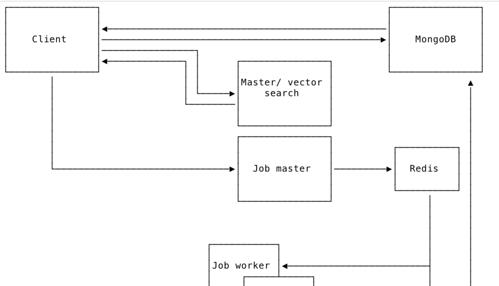

### Store images in MongoDB

We start by taking the images from a dataset on disk and storing them in MongoDB.

By the way, getting to a stage of "dataset on disk" or "data in S3 bucket" might not be so easy, as they can be in many different places and micro-services. SuperDuperDB has easy ways to retrieve and process a remote resource URI. (**TODO**: link to docs or code ) (**TODO:** Duncan, in the notebook, is there a way to make URIs and encoders play together so that URI is downloaded and encoded? Now i first read the image from disk and then encode it, It would be nice to demo it here if it is possible)


In the below code snippet, we take an image from the dataset and encode it into a binary object for convenient storage in MongoDB.

First, we create a SuperDuperDBDocument object. It allows easy storage of complex data types in a database via Encoders — images, audio files, PyTorch tensors and vector embeddings. Here we use an encoder for images - `image_encoder`

Then we insert the documents into MongoDB via `insert_many`. We supply our `image_encoder` as an argument, so that... [TODO: how is it used? I suspect it is for reading but couldn't find explicit mention. ]

(**TODO**: maybe make naming convention more aligned in the repo - camelcase or underscores, Document or pil_image )

```python
from superduperdb.core.document import Document as SuperDuperDocument

from superduperdb.encoders.pillow.image import pil_image as image_encoder

sdp_documents = [SuperDuperDocument({'image': image_encoder(r['image'])}) for r in dataset]

db.execute(collection.insert_many(sdp_documents, encoders=(image_encoder,)))
```

For a convenient data inspection, you can use [MongoDB Compass](https://www.mongodb.com/try/download/compass), a desktop UI. This is just one of the many perks of working within the MongoDB ecosystem.

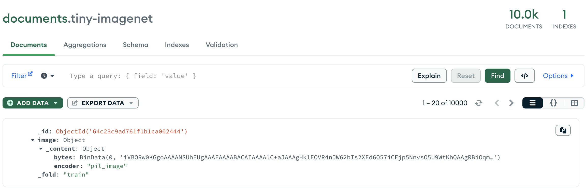


# Create Semantic Vectors of Images and Text

 We will now use CLIP to assign "meaning" vectors to our product catalogue and to use queries. 
 ```python
import torch
import clip

from superduperdb.encoders.torch.tensor import tensor as tensor_encoder
from superduperdb.models.torch.wrapper import TorchModel

my_tensor_encoder = tensor_encoder(torch.float, shape=(512,))

model, preprocess = clip.load("ViT-B/32", device='cpu')
```

 I chose a popular version of the CLIP neural network architecture - "ViT-B/32" as it is not too slow, and also provides good enough results. "ViT" stands for Visual Transformer, the neural network architecture used. "B" stands for "model of depth Base". There are several depths that CLIP can be and they define the size of the model. For example, L(for Large) is the next in size and it is much larger and slower to run. "32" means that the model reads the image in small patches of 32 x 32 pixels at a time. There are also steps in image pre-processing (resizing, adjusting brightness, contrast) and text tokenization (converting words into sub-words and their vectors).

I deliberately don't go into much detail about what all these parameters mean as this is not where the value lays for having a great semantic search in your shop. Changing "ViT-Base/32" to "ViT-Huge/14" or changing text tokenizer to Roberta might improve things, but it will also complicate them. The main improvement for your shop will come from fine-tuning CLIP on your own images, specific to your domain. That gives real improvements even on a small model. SuperDuperDB makes this fine-tuning easy to execute - more in an up-coming blog post.

 
```python

text_model = TorchModel(
 identifier='clip_text',
 object=model,
 preprocess=lambda x: clip.tokenize(x)[0],
 forward_method='encode_text',
 encoder=my_tensor_encoder
)

visual_model = TorchModel(
 identifier='clip_image',
 preprocess=preprocess,
 object=model.visual,
 encoder=my_tensor_encoder,
)
```

We load the model to run on a CPU via PyTorch. We again employ a SuperDuperDB encoder for easy database storage - this time it is for our vectors that come as 512-dimensional PyTorch arrays, also known as tensors.

We have two different models - one to get a vector for a text, like "sneakers". And another to get the meaning vector out of an image of sneakers.  

```python
from superduperdb.core.vector_index import VectorIndex
from superduperdb.core.watcher import Watcher

db.add(
    VectorIndex(
        'my-index',
        indexing_watcher=Watcher(
            model=visual_model,
            key='image',
            select=collection.find(),
        ),
        compatible_watcher=Watcher(
            model=text_model,
            key='text',
            active=False,
        )
    )
)```

In this code snippet below, we will now create meaning vectors for every image in our product catalog. It is done offline as catalogues contain millions of items. 

Adding the `visual_model` as a SuperDuperDB watcher ensures that vectors for new images are automatically generated as they are inserted to the collection. A watcher thread continuously scans the database for new data.

We will also add a way to query the image database with text query via a ``compatible_watcher`` that uses `text_model`. The watcher is labelled as `active=False` because we don't need to index the images in the catalog with the text model. It is only for incoming text search queries.

The different  modalities of image and text are mixed here in this vector index. That is why it is sometimes called a "multi-modal search". This is our "meaning space" that we talked about in the introduction.


This is how the model output is stored in MongoDB. Any model run will be stored in the _outputs field of the document used as input. Future versions will track and version each model run, so stay tuned.

```json
{
  "_id": {
    "$oid": "64c23c9ad761f1b1ca002444"
  },
  "image": {
    "_content": {
      "bytes": {
        "$binary": {
          "base64": "iVBORw0KGgo...",
          "subType": "00"
        }
      },
      "encoder": "pil_image"
    }
  },
  "_fold": "train",
  "_outputs": {
    "image": {
      "clip_image": {
        "_content": {
          "bytes": {
            "$binary": {
              "base64": "vyc7vEK/nL4oM...",
              "subType": "00"
            }
          },
          "encoder": "torch.float32[512]"
        }
      }
    }
  }
}
```


## Searching The Catalog

Here is the code to search the Footwear catalog category for images similar to the word "sneakers". It is used to run the demo in this [notebook](blog_version_multimodal_image_search_clip.ipynb). 

```python
    db = pymongo.MongoClient().documents
    db = superduper(db)

    collection = Collection(name='fashion-images')
    cursor = collection
        
    similar_doc = SuperDuperDocument({'text':'sneakers'})
    cursor = cursor.find({'Category': 'Footwear'}).like(similar_doc, vector_index='my-index', n=20)
        
    results = db.execute(cursor)

```

Python Mongo developers recognise the familiar PyMongo `find` API call here. SuperDuperDB allows to combine it with semantic search similarity search `like` function while preserving all the PyMongo features. Here we first filter to the Footwear part of the catalogue using MongoDB efficient data querying, and then run a computationally expensive similarity search on this subsection of the data.

Also, the `results` behaves like PyMongo query results.

(**TODO:** Duncan, what else are the nice parts of the API to mention here?)

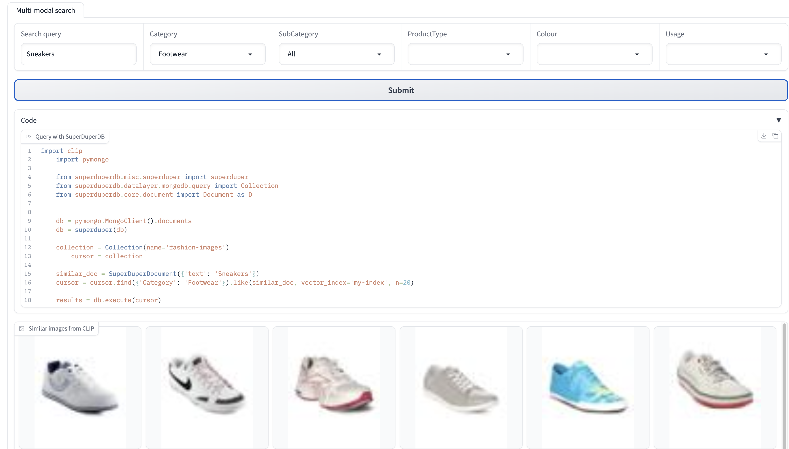


## Serving To The Front-End

If you are already on the  [FARM Web-stack](https://www.mongodb.com/developer/languages/python/farm-stack-fastapi-react-mongodb/) (FastAPI, React, and MongoDB), then you can wrap this code in FastAPI and serve it as in in this [demo](https://github.com/weaviate/weaviate-examples/tree/main/clip-multi-modal-text-image-search)

 (**TODO:** build analogue to this Weaviate FastApi React demo but with superduperDB,  show model confidence, add new image upload capability.)

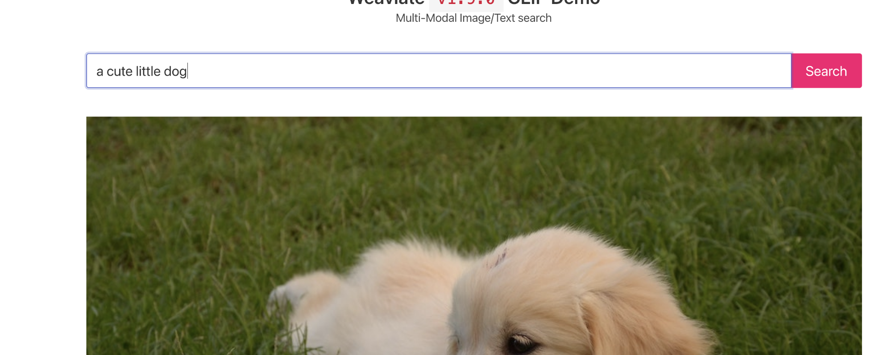

We're also developing a REST API that allows SuperDuperDB's vector index to collaborate with other web backends, such as Node.js or no-code Web frameworks like Bubble.

(**TODO:** question to you: is it actually the roadmap? :) ).

## Upcoming Blog Post: Model Training and Comparisons

In my upcoming blog post, I'll explore how to enhance search functionality for your specific e-commerce store.

For instance, suppose you run a specialized store that sells candles. While the standard CLIP model can distinguish between a candle and a candlestick, it can't differentiate between "tea light" and "pillar" candles.

With SuperDuperDB, you can easily train CLIP on your data with just a few lines of code. Depending on your image count, this training might take a couple of days on a GPU. To justify this time and cost, you'll want to ensure that your training code is efficient and bug-free. Here using an open-source solution like SuperDuperDB, gives more confidence. The open code has many eyes on it but people using it, and is built on the expertise of the maintainers who used this approach in commercial projects over the years.

SuperDuperDB also simplifies model comparisons on identical data.

To illustrate the ease of qualitative comparison between two models using SuperDuperDB, we've added two vector indices to the same MongoDB, searched them concurrently, and compared the results in a Gradio UI [here](../../notebooks/compare_multimodal_image_search_clip_openclip.ipynb) . The two models have the same CLIP architecture, but one was trained by OpenAI on their closed-source dataset and the other on the open-source [LAION 2B](https://huggingface.co/laion/CLIP-ViT-B-32-laion2B-s34B-b79K).
(**TODO:** change to ecommerce example)

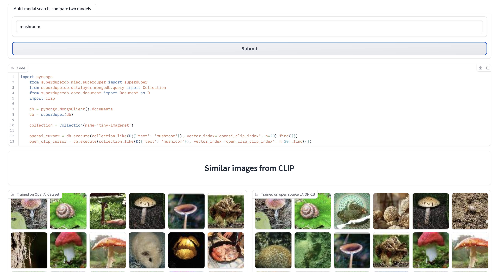

## Conclusion

SuperDuperDB provides an efficient and streamlined way to improve the search experience on your e-commerce platform. It enables you to transition from manual tagging to a more precise and intuitive semantic search, leveraging the power of CLIP models and MongoDB. This brings about new opportunities, such as presenting your users with more relevant search results, while reducing the burden of maintaining manual tags in your product catalog.

But the versatility of SuperDuperDB extends beyond merely enhancing image search. It offers seamless integration with MongoDB-based web stacks, provides utilities for comparing and testing models, and even supports model training for a more personalized, tailored search experience.

The future of e-commerce search isn't limited to keyword matching. It's about comprehending the user's intent and delivering the most pertinent results. And with SuperDuperDB, that future is within your grasp.

Semantic search is just the tip of the iceberg when it comes to SuperDuperDB's utility in e-commerce. It can work with sklearn models to classify new products, determining which section of the catalog they should be assigned to based on their CLIP image vectors, or even use OpenAI embeddings of their descriptions.

Stay tuned for our next blog post where we will delve deeper into training and comparing models to further customize and enhance your e-commerce platform's search experience.


