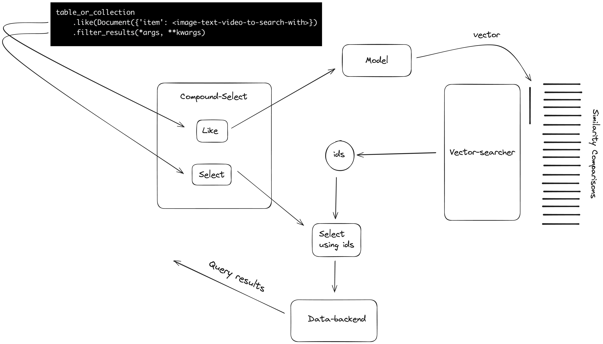

# Vector-search

SuperDuperDB allows users to implement vector-search in their database by either 
using in-database functionality, or via a sidecar implementation with `lance` and `FastAPI`.

## Philosophy

In `superduperdb`, from a user point-of-view vector-search isn't a completely different beast than other ways of 
using the system:

- The vector-preparation is exactly the same as preparing outputs with any model, 
  with the special difference that the outputs are vectors, arrays or tensors.
- Vector-searches are just another type of database query which happen to use 
  the stored vectors.

## Algorithm

Here is a schematic of how vector-search works:



## Explanation

A vector-search query has the schematic form:

```python
table_or_collection
    .like(Document(<dict-to-search-with>))      # the operand is vectorized using registered models
    .filter_results(*args, **kwargs)            # the results of vector-search are filtered
```

```python
table_or_collection
    .filter_results(*args, **kwargs)            # the results of vector-search are filtered
    .like(Document(<dict-to-search-with>))      # the operand is vectorized using registered models
```

...or

The type of such a query is a `CompoundSelect`. It's 2 parts are the vector-search part (`like`) and the 
filtering part (`select`).

In the first case, the operand of `like` is dispatched to a **model**, which converts this into a **vector**.
The **vector** is compared to previously saved outputs of the same or a paired **model** (multi-modal).
The most similar `ids` are retrieved. The `select` part of the query is then transformed to 
a similar query which searches within the retrieved `ids`. The full set of results are returned
to the client.

Read [here](../walkthrough/vector_search.md) about setting up and detailed usage of vector-search.
