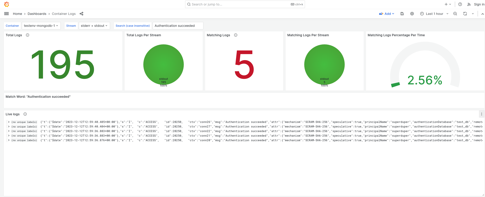

# System Observability


To enhance the observability of our setup, we've integrated `Grafana` with `Prometheus` for monitoring system resources and `Loki` for centralized logging.

To get started, initiate the `testenv` using the following command:

```
make testenv_init
```

## Resource Monitoring

We employ `cadvisor` to gather metrics from containers, and `Prometheus` to aggregate these metrics into a time series database. 

`Grafana` interfaces with `Prometheus` to showcase real-time metrics on dashboards, accessible at:
```
http://localhost:3000/d/system/system-resources
```


## Container Logging

For centralized log management, we utilize promtail to collect `stdout` and `stderr` from containers, while Loki aggregates the logs. 

Grafana interfaces with Loki to present real-time logs on dashboards, accessible at:
```
http://localhost:3000/d/system/system-resources
```

