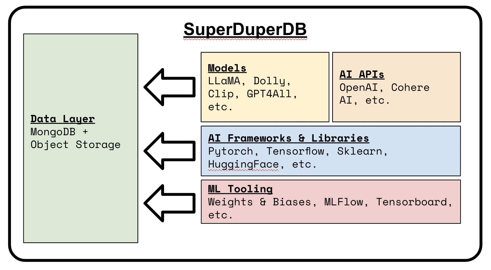

# SuperDuperDB documentation

🚀 Welcome to SuperDuperDB! 🚀 

## What is SuperDuperDB?

SuperDuperDB is a Python package providing tools for developers to apply AI and machine learning
in their already deployed datalayer, and simulatenously to set-up a scalable, open-source and auditable environment to do this.



## Mission

At SuperDuperDB, our goal is to massively smoothen and accelerate the developer journey between data and AI models. We aim to:

- Create an **easy-to-use**, **extensible** and **comprehensive** Python framework for integrating AI and 
  ML directly to the datalayer: to databases, object-storage, data-lakes and data-warehouses.
  
- Empower developers, data scientists and architects to leverage the vast **PyData**, AI
  **open-source ecosystem** in their datalayer deployments.
  
- Enable ways-of-working with AI and data which **enable scalability** and industrial scale deployment,
  as well as providing easy-to-use tools for the **individual developer**.

- Make possible continued use of **already existing or deployed databases**, in combination with AI and ML; 
  **no migration of data** to a fancy, new fangled vector-database required.
  
- Follow a **fully open-source approach**, in particular prioritizing open-source integrations 
  in our roadmap going forward

- Enable individuals and organizations to **circumvent vendor lock-in strategies** now ubiquitous
  in the AI and ML landscapes, by providing a clear toolset to flexibly deploy AI at the 
  datalayer **without necessitating subscriptions**, cloud installations, gated-model-API functionality.
  
## Background

SuperDuperDB is the result of years of experience in research, development and production for 
AI and data. We have come to believe that AI development with data does not need to be as hard as it 
currently is. (Read "{doc}`common_issues`"
for more context.) By moving to a closer symbiosis of AI and datalayer/ database, we believe
many pain-points in AI development become non-issues. With SuperDuperDB:

- Model predictions may be [evaluated and inserted back into the database](#model-frameworks-directly-integrated-with-databases), without ever needing 
  to load data from the database to the client-side.
- Training may be [deployed in one line](#model-frameworks-directly-integrated-with-databases), without having to munge, preprocess or fetch data;
  simply point to the data with a data-base query.
- Models may be configured to [watch for incoming data](#continuous-model-processing-on-incoming-data), maintaining a catalogue of up-to-date
  predictions and features.
- Working [with difficult data types](#support-for-tricky-datatypes), (images, audio, etc.) requires no additional effort in comparison
  to working with "standard data" (numbers, text, etc.)
- Outputs of configured AI models may be used to "navigate" the database, including [configuring
  and using vector-search](#use-your-classical-database-as-a-vector-database)
  with just a few lines of Python code.

## High-Level Features

In the initial [v0.1 release]() we have built the following features on top of MongoDB, with a view to greatly expanding our breadth to a range of datalayer implementations, especially implementations which use SQL-dialects  as the query-language. You can follow the high-level roadmap [here]().

### Model frameworks directly integrated with the datalayer

SuperDuperDB includes wrappers for treating models from diverse AI frameworks across the open-source Python ecosystem uniformly in combination with the datalayer, using a scikit-learn-like
`.fit` and `.predict` API.

```python
# [ Code snippets assume access to a running MongoDB instance read/write ]
from sklearn.svm import SVC
import pymongo

from superduperdb.datalayer.mongodb import Collection
from superduperdb import superduper

# Models and database clients can be converted to SuperDuperDB objects with a simple wrapper.
model = superduper(SVC())

# SuperDuperDB uses MongoDB by default. SQL integrations are on the way.
db = superduper(pymongo.MongoClient().my_db)

# Once wrapped, we can fit and predict "in" the database, simply
# specifying the data to be processed with a query.
coll = Collection(name='my_collection')
model.fit(X='input_col', y='predict_col', db=db, select=coll.find({'_fold': 'train'}))

# Predictions are saved in the database alongside the inputs.
model.predict(X='input_col', db=db, select=coll.find({'_fold': 'valid'}))
```

### Continuous model processing on incoming data
SuperDuperDB contains components allowing developers to configure models to continuously infer outputs on specified data, and save the outputs back to the database.

```python
# Watch the database for incoming data, and process this with a model
# Model outputs are continuously stored in the input records
model.predict(X='input_col', db=db, select=coll.find(), watch=True)
```

### Support for "tricky" datatypes

SuperDuperDB includes tools for working in the database with the complex data types necessary for AI, such as vectors, tensors, images, audio etc. Native python types may be flexibly saved to the DB, to ease use in tricky AI use-cases, such as computer vision.

```python
from superduperdb.encoders.pillow import pil_image as i

# Encoders are first class SuperDuperDB objects which deal with serializing
# "non-standard" data to the database
db.execute(
    coll.insert_many([
        {'img': i(PIL.image.open(path))} for path in images
    ])
)
```

Data may be reloaded using standard database queries, and conveniently reused in downstream applications, or consumed as direct inputs to AI models. The data loaded are instances of the same Python classes as inserted.

```python
>>> r = db.execute(coll.find_one())
>>> r['img'].x
<PIL.PngImagePlugin.PngImageFile image mode=RGBA size=1164x860> 
```

### Use your classical database as a vector database

SuperDuperDB contains functionality allowing users to treat their standard database as a vector-search database, integrating your primary database with key-players in the open-source vector-search space.
```python
# First a "Watcher" makes sure vectors stay up-to-date
indexing_watcher = Watcher(model=OpenAIEmbedding(), key='text', select=collection.find())

# This "Watcher" is linked with a "VectorIndex"
db.add(VectorIndex('my-index', indexing_watcher=indexing_watcher))

# The "VectorIndex" may be used to search data. Items to be searched against are passed 
# to the registered model and vectorized. No additional app layer is required.
# By default, SuperDuperDB uses LanceDB for vector comparison operations
db.execute(collection.like({'text': 'clothing item'}, 'my-index').find({'brand': 'Nike'}))
```

## Contents

```{toctree}
:maxdepth: 2

getting_started
concepts
encoders
data_references
models
prediction_and_training
watchers
vector_index
jobs
cluster
common_issues
full_usage
```